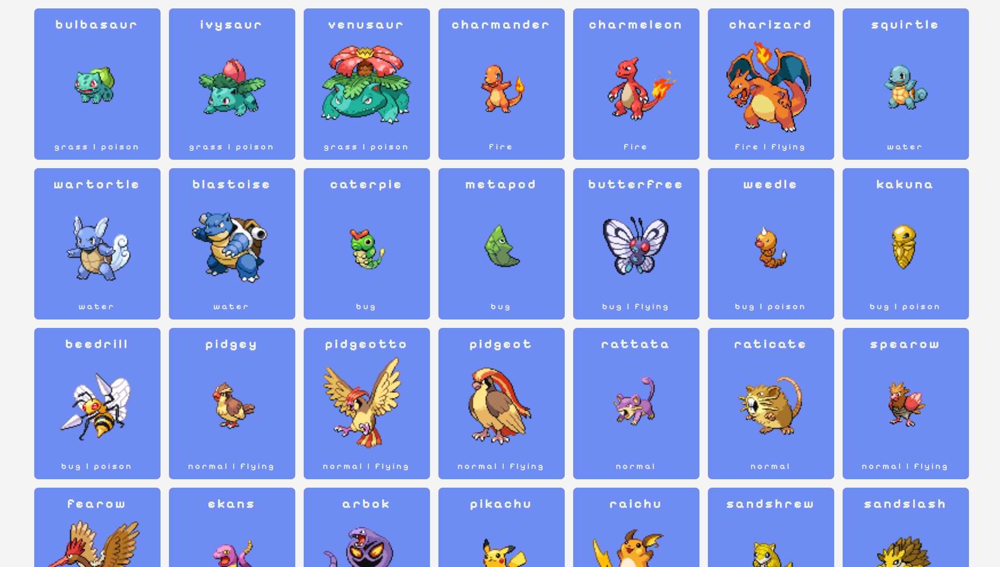

# Projeto POKEAPI

## Sobre
O projeto exibe na tela os pokemons da famosa API PokeAPI. Esse projeto foi criado com o intuito de praticar requisições GET e consumo de API através do fetch do javascript, além também de exercitar o uso de promises em conjunto com DOM.

## Funcionalidades Implementadas
- 🔍 Consulta à PokéAPI: Consome dados diretamente da API oficial, obtendo informações detalhadas de cada Pokémon.

- 🧩 Renderização dinâmica dos cards dos Pokémon na tela, com nome, imagem e tipos exibidos com cores personalizadas conforme seu tipo (ex: água, fogo, planta).

- 🖱️ Botão “Show Details” para cada Pokémon, que exibe um card detalhado com:

  - ID do Pokémon

  - Tipos

  - Altura e peso

  - Habilidades

  - Espécie

  - Status base com barras de progresso dinamicas

  - Cálculo e exibição do total de status

- ➕ Botão “Show More” para carregar novos Pokémon incrementando a lista, sem recarregar a página.

- 🎨 Estilo visual personalizado por tipo de Pokémon, que aplica cores com base nos tipos de cada criatura.

- 🧠 Prevenção de repetição de detalhes: Ao clicar no botão de detalhes mais de uma vez, o app evita múltiplas renderizações duplicadas do mesmo card.

## 🧱 Tecnologias Utilizadas
- HTML5

- CSS3

- JavaScript ES6+

- PokéAPI