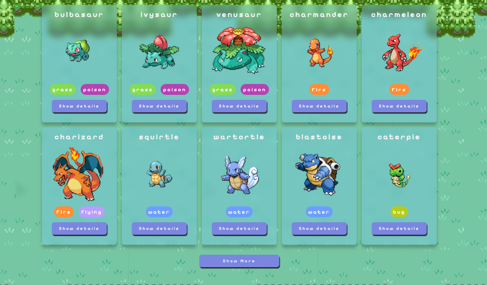

# Projeto POKEAPI

## Sobre
O projeto exibe na tela os 100 primeiros pokemons da famosa API PokeAPI. Esse projeto foi criado com o intuito de praticar requisições GET e consumo de API através do fetch do javascript, além também de exercitar o uso de promises em conjunto com DOM.

